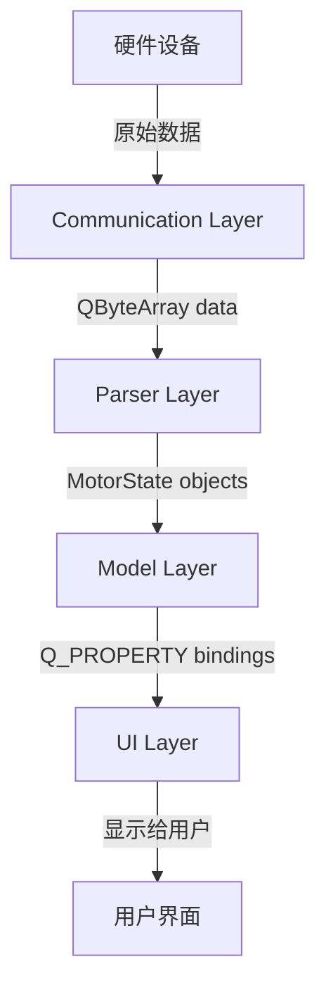
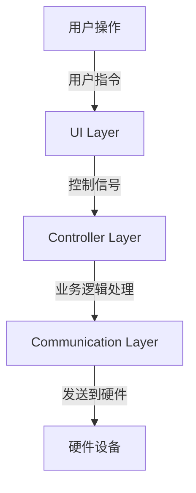

# 项目架构通信机制

## 项目概述

这是一个基于Qt6的C++桌面应用程序，用于电机控制和通信。项目采用**四层分层架构**，使用Qt信号槽机制实现层间通信，确保组件解耦和数据流向清晰。

## 架构分层

```
┌─────────────────────────────────────────────────────────────┐
│                      UI Layer                               │
│                   (QML/Widget UI)                          │
└─────────────────────────────────────────────────────────────┘
                              ↕ (信号槽)
┌─────────────────────────────────────────────────────────────┐
│                  Controller Layer                           │
│                  (业务逻辑协调层)                            │
└─────────────────────────────────────────────────────────────┘
                              ↕ (信号槽)
┌─────────────────────────────────────────────────────────────┐
│                    Model Layer                              │
│                 (UI数据模型层)                               │
└─────────────────────────────────────────────────────────────┘
                              ↕ (信号槽)
┌─────────────────────────────────────────────────────────────┐
│                    Parser Layer                             │
│                (协议解析层)                                   │
└─────────────────────────────────────────────────────────────┘
                              ↕ (信号槽)
┌─────────────────────────────────────────────────────────────┐
│                Communication Layer                          │
│              (通信层：CAN/TCP/Serial)                        │
└─────────────────────────────────────────────────────────────┘
                              ↕
                      硬件设备 (电机/CAN总线)
```

## 各层详细说明

### 1. Communication Layer (通信层)

**职责**：硬件通信管理
- CAN总线通信 (CANManager)
- 串口通信 (SerialPortManager)
- TCP/UDP网络通信
- 数据收发和连接管理

**核心类**：
- `CANManager` - CAN总线管理
- `SerialPortManager` - 串口通信管理
- `NetworkManager` - 网络通信管理 (未来扩展)

**输出信号**：
```cpp
// 数据接收信号
void dataReceived(const QByteArray &data);
void textReceived(const QString &text);

// 连接状态信号
void connectionStatusChanged(bool connected);
void portOpened(const QString &portName);
void portClosed();

// 错误信号
void errorOccurred(const QString &error);
```

---

### 2. Parser Layer (解析层)

**职责**：数据协议解析
- 将原始 `QByteArray` 解析为结构化 `MotorState`
- 协议验证和错误处理
- 数据包完整性检查

**核心类**：
- `Parser` - 数据解析器
- `MotorState` - 电机状态数据结构

**输入**：原始字节数据 (`QByteArray`)
**输出信号**：
```cpp
// 解析完成信号
void motorStateUpdated(const MotorState &state);
void allMotorStatesUpdated(const QVector<MotorState> &states);

// 错误信号
void parseError(const QString &error);
void protocolError(const QString &error);
```

---

### 3. Model Layer (模型层)

**职责**：UI数据模型
- 使用 `QObject + Q_PROPERTY` 实现数据绑定
- 为UI层提供数据接口
- 管理电机状态数据缓存

**核心类**：
- `MotorModel` - 电机数据模型
- 可能还有其他UI相关模型

**输入**：结构化 `MotorState` 数据
**输出**：QML/Widget可直接绑定的属性
```cpp
class MotorModel : public QObject {
    Q_OBJECT
    Q_PROPERTY(bool isOnline READ isOnline NOTIFY stateChanged)
    Q_PROPERTY(float currentSpeed READ currentSpeed NOTIFY stateChanged)
    Q_PROPERTY(float currentAngle READ currentAngle NOTIFY stateChanged)
    // ... 更多属性
};
```

---

### 4. Controller Layer (控制层)

**职责**：业务逻辑协调
- 初始化和管理各层组件
- 建立层间信号槽连接
- 处理跨层业务逻辑
- UI事件处理和业务规则实现

**核心类**：
- `MainController` - 主控制器
- `MotorController` - 电机控制器
- `MainWindow` - 主窗口 (也承担部分控制职责)

---

### 5. UI Layer (界面层)

**职责**：用户界面
- QML界面 (现代UI)
- Widget界面 (传统UI)
- 用户交互和数据显示

## 数据流向

### 正向数据流 (硬件 → UI)



### 反向数据流 (UI → 硬件)



## 信号槽连接示例

### 在Controller层建立连接

```cpp
class MainController : public QObject {
public:
    MainController(QObject *parent = nullptr) : QObject(parent) {
        initializeLayers();
        establishConnections();
    }

private:
    void initializeLayers() {
        // 创建各层实例
        m_serialManager = new Communication::SerialPortManager(this);
        m_parser = new Parser(this);
        m_motorModel = new MotorModel(this);
    }

    void establishConnections() {
        // Communication → Parser
        connect(m_serialManager, &SerialPortManager::dataReceived,
                m_parser, &Parser::parseByteStream);

        // Parser → Model
        connect(m_parser, &Parser::motorStateUpdated,
                m_motorModel, &MotorModel::updateMotorState);

        // Model → UI (通过QML上下文或信号槽)
        connect(m_motorModel, &MotorModel::stateChanged,
                this, &MainController::handleModelStateChanged);

        // 错误处理链
        connect(m_serialManager, &SerialPortManager::errorOccurred,
                this, &MainController::handleCommunicationError);

        connect(m_parser, &Parser::parseError,
                this, &MainController::handleParseError);
    }

private:
    Communication::SerialPortManager *m_serialManager;
    Parser *m_parser;
    MotorModel *m_motorModel;
};
```

## 具体通信场景

### 场景1：串口数据接收

1. **Communication层**：
   ```cpp
   // SerialPortManager 接收数据
   void SerialPortManager::handleReadyRead() {
       QByteArray data = m_serialPort->readAll();
       emit dataReceived(data);  // 发送到Parser层
   }
   ```

2. **Parser层**：
   ```cpp
   // Parser 解析数据
   void Parser::parseByteStream(const QByteArray &byteStream) {
       MotorState state = parseMotorState(byteStream);
       emit motorStateUpdated(state);  // 发送到Model层
   }
   ```

3. **Model层**：
   ```cpp
   // MotorModel 更新数据
   void MotorModel::updateMotorState(const MotorState &state) {
       m_currentState = state;
       emit stateChanged();  // 通知UI更新
   }
   ```

4. **UI层**：
   ```qml
   // QML自动绑定更新
   Text {
       text: "当前速度: " + motorModel.currentSpeed + " RPM"
   }
   ```

### 场景2：用户控制指令

1. **UI层**：
   ```qml
   Button {
       text: "启动电机"
       onClicked: controller.startMotor()
   }
   ```

2. **Controller层**：
   ```cpp
   void MainController::startMotor() {
       // 业务逻辑处理
       QByteArray command = buildStartCommand();
       m_serialManager->sendData(command);  // 发送到Communication层
   }
   ```

3. **Communication层**：
   ```cpp
   bool SerialPortManager::sendData(const QByteArray &data) {
       return m_serialPort->write(data) != -1;  // 发送到硬件
   }
   ```

## 错误处理机制

### 分层错误处理

1. **Communication层错误**：
   ```cpp
   void SerialPortManager::handleError(QSerialPort::SerialPortError error) {
       QString errorMessage = getErrorMessage(error);
       emit errorOccurred(errorMessage);  // 上报错误
       if (isCriticalError(error)) {
           closePort();  // 自动处理严重错误
       }
   }
   ```

2. **Parser层错误**：
   ```cpp
   void Parser::parseByteStream(const QByteArray &byteStream) {
       if (!validateProtocol(byteStream)) {
           emit protocolError("协议格式错误");
           return;
       }
       // 继续解析...
   }
   ```

3. **Controller层集中处理**：
   ```cpp
   void MainController::handleCommunicationError(const QString &error) {
       // 记录日志
       logError(error);

       // 更新UI状态
       emit showError(error);

       // 尝试恢复连接
       attemptReconnection();
   }
   ```

## 优势

### 1. **松耦合设计**
- 各层只依赖下层，不跨层调用
- 通过信号槽实现解耦通信
- 便于单元测试和模块替换

### 2. **清晰的职责分离**
- 每层职责明确，易于维护
- 新功能添加不会影响其他层
- 代码复用性高

### 3. **异步通信**
- Qt信号槽天然支持异步
- 避免阻塞UI线程
- 提高应用响应性

### 4. **错误隔离**
- 错误不会直接传播到其他层
- 每层都有独立的错误处理机制
- 提高系统稳定性

## 最佳实践

### 1. **信号命名规范**
- 使用清晰的动词开头：`dataReceived`, `stateUpdated`
- 包含数据类型信息：`motorStateUpdated(const MotorState&)`
- 错误信号统一后缀：`errorOccurred`, `parseError`

### 2. **连接管理**
- 在Controller层统一建立连接
- 使用Qt5式连接语法保证类型安全
- 避免重复连接和内存泄漏

### 3. **数据验证**
- 每层都要进行数据验证
- Parser层重点验证协议格式
- Model层验证数据范围和有效性

### 4. **性能考虑**
- 避免频繁的信号发射
- 大数据使用指针传递
- 适当使用QTimer防抖

这种分层架构确保了代码的可维护性、可测试性和可扩展性，是Qt企业级应用的推荐模式。